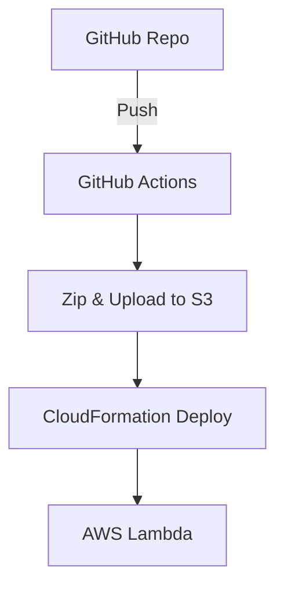

# AWS Lambda CI/CD Pipeline with GitHub Actions & CloudFormation

This project demonstrates an enterprise-grade CI/CD pipeline from GitHub to AWS Lambda using GitHub Actions and AWS CloudFormation.

## Project Structure
- `lambda_function.py` — Python Lambda handler
- `requirements.txt` — Python dependencies
- `lambda-cfn.yaml` — CloudFormation template for Lambda deployment
- `.github/workflows/deploy.yml` — GitHub Actions workflow for CI/CD

---

## Step-by-Step Setup Lets check part 1

### 1. AWS Side

#### a. Create S3 Bucket for Lambda Artifacts
```
aws s3 mb s3://your-lambda-artifacts-bucket
aws s3api put-bucket-versioning --bucket your-lambda-artifacts-bucket --versioning-configuration Status=Enabled
```

#### b. Create IAM Role for GitHub Actions (OIDC)
- Go to IAM > Identity providers > Add provider:
  - Provider type: OIDC
  - Provider URL: https://token.actions.githubusercontent.com
  - Audience: sts.amazonaws.com
- Create an IAM role with trust policy for your repo:
```
{
  "Effect": "Allow",
  "Principal": {
    "Federated": "arn:aws:iam::<ACCOUNT_ID>:oidc-provider/token.actions.githubusercontent.com"
  },
  "Action": "sts:AssumeRoleWithWebIdentity",
  "Condition": {
    "StringLike": {
      "token.actions.githubusercontent.com:sub": "repo:YOUR_GITHUB_ORG/YOUR_REPO:*"
    }
  }
}
```
- Attach a policy allowing CloudFormation, Lambda, S3, and PassRole for Lambda execution role.

#### c. Create Lambda Execution Role
- Create a role for Lambda with basic execution permissions (CloudWatch logs, etc).

---

### 2. GitHub Side

#### a. Add Files to Your Repo
- `lambda_function.py`, `requirements.txt`, `lambda-cfn.yaml`, `.github/workflows/deploy.yml`

#### b. Update Placeholders
- Replace `<ACCOUNT_ID>`, `<GITHUB_ACTIONS_ROLE>`, and `your-lambda-artifacts-bucket` in the workflow and templates with your actual values.

#### c. Push to main branch
- Triggers the workflow: builds, tests, zips, uploads, and deploys Lambda via CloudFormation.

---

## Best Practices
- Use OIDC for GitHub Actions (no static secrets)
- Restrict IAM permissions to least privilege
- Enable S3 versioning
- Add test and approval steps as needed
- Monitor with CloudWatch

---

## Diagram
